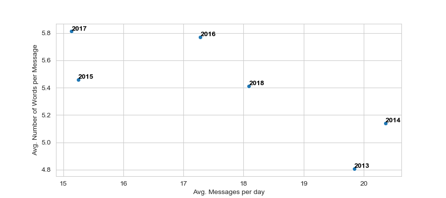

# Kobibot

**Analysis of WhatsApp data.**

For over 6 years I have been in a WhatsApp Group chat with few of the
funniest and lovely lunatics which I like to refer to as my friends from
school. After switching to Threema for obvious reasons I asked one of
them to pass me a dump of the group chat to see if I could find insights
from the data.

This project is still ongoing. For now three main parts are planned: 
1. Meta-Data Analysis
2. Analyzing the Messages
3. Building a chat bot that talks and behaves like me and my friends
   (Heaven forbid!)
 
### Preprocessing
First step - as in every data science project - is data cleansing and
preprocessing. This is done by the scripts in
[this directory](metadata_analysis). It requires the data to be in text
format where each line is one message with timestamp and sender name.
Depending on the language settings of your phone the data has a
different format. In my case the dump came from a german phone.
Therefore, the data had the following format:
```text
dd.mm.yy, HH:MM - <sender name>: <message>
```
After removing system messages and the script basically extracts the
timestamp, the sender name, the message, the number of words in the
message, the number of letters in the message as well as information of
the first responder and to whom this given message was a response and
dumps this information to a CSV File. Also dumps a list of the plain
messages without timestamp or sender information as a corpus used for
the chatbot training.

### Meta-Data Analysis
The descriptive analysis is mostly done in
[this script](metadata_analysis/descriptive_analysis.py). The first plot
of the meta data analysis displays nothing more than the date and time
when a message was sent.
 
 

Obviously, our friendship did not get weaker over time since the average
amount of sent messages remain more or less the same. However, there
seems to be a yearly trend with peaks in summer and drops during the
fourth quarter of the year. Could be due to the general fatigue after
the Octoberfest... Also you can see the drop in the monthly amount of
message when we decided to switch to Threema by the beginning of 2019.

If we take a look at the yearly aggregated traffic per day - determined
by the average amount of messages per day and the average amount of
words per message (whereas emojis are counted as one letter) there seems
to be a trend towards less but longer messages, although 2018 was a
pretty average year.

 

The following flowchart depicts the message flow from each member of the
group to each other member whereby, the size of the nodes show the
absolute number of messages written and the width of the edges display
the number of messages written to this specific member. If the color of
the node is the same as the color of the edge this means that the
message was sent by this node. 

 

It can be seen that few members of the group send a large amount of
messages and that they seem to communicate between each other (e.g.
*MSt*) whereas, the remaining members do not communicate that much but
if they do, their communication seems so be much more balanced towards
each member than the *high traffic* members (e.g. *FA*).